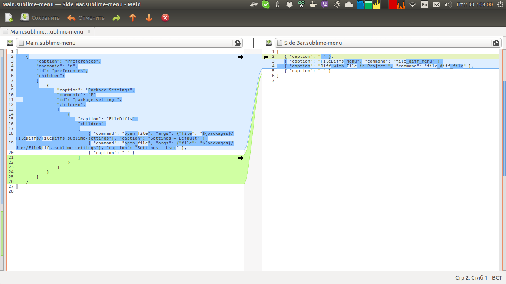

FileDiffs Plugin
================
[](https://github.com/CodeByZach/sublime_file_diffs/releases)

Shows diffs between the current file, or selection(s) in the current file, and clipboard, another file, or unsaved changes. Can be configured to show diffs in an external diff tool

## Preview




--------------

Help!
-----

Check the [wiki][] for more tips

[wiki]: https://github.com/CodeByZach/sublime_file_diffs/wiki

Installation
------------

### Package Control (Easiest)

1. Using Package Control, install `FileDiffs`

2. Install keymaps for the commands (see Example.sublime-keymap for my preferred keys)

### Sublime Text 3

1. Open the Sublime Text Packages folder
    - OS X: `~/Library/Application Support/Sublime Text 3/Packages/`
    - Windows: `%APPDATA%/Sublime Text 3/Packages/`
    - Linux: `~/.Sublime Text 3/Packages/` or `~/.config/sublime-text-3/Packages`

2. Clone this repo

    ```
    # Over SSH
    git clone git@github.com:CodeByZach/sublime_file_diffs

    # Over HTTPS
    git clone https://github.com/CodeByZach/sublime_file_diffs.git
    ```

3. Install keymaps for the commands (see Example.sublime-keymap for my preferred keys)

Add External Diff Tool *(optional)*
--------

(IMPORTANT: You might need to make a symlink (e.g. in /usr/local/bin) pointing to the command line tool of your external diff tool)

1. Preferences > Package Settings > FileDiffs > Settings - Default

2. Uncomment one of the examples or write your own command to open external diff tool.

   This command *may* need to be a full path (e.g. `/usr/local/bin/ksdiff`), if the command isn't in your `PATH`.

It supports:

-   A generic setting `FileDiffs.sublime-settings` which could be overloaded for each parameter in a platform specific configuration `FileDiffs ($platform).sublime-settings` in the `Settings - User`
-   Environment variable expansions for `cmd` parameter in the settings


Commands
--------

`file_diff_menu`: Shows a menu to select one of the file_diff commands.  If you use the bindings in Example.sublime-keymap, this is bound to `ctrl+shift+d`.

The rest of the commands do not need to be bound (accessible from the menu):

`file_diff_clipboard`: Shows the diff of the current file or selection(s) and the clipboard (the clipboard is considered the "new" file unless `reverse` is True)

`file_diff_selections`: Shows the diff of the first and second selected regions.  The file_diff_menu command checks for exactly two regions selected, otherwise it doesn't display this command.

`file_diff_saved`: Shows the diff of the current file or selection(s) and the saved file.

`file_diff_file`: Shows the diff of the current file or selection(s) and a file that is in the current project.

`file_diff_tab`: Shows the diff of the current file or selection(s) and an open file (aka a file that has a tab).

`file_diff_previous`: Shows the diff of the current file or selection(s) and the previous activated file. If a file is not saved yet, dirty buffer is used instead of reading from disk.

If FileDiffs has to use temporary files, they are created in your `Data/Packages` folder (rather than system temp folder) due to privacy concerns for portable Sublime Text installations. Temporary files are automatically removed after 15 seconds.

Contributors
------------

Thanks to:

- **Sebastian Pape** for adding support for using an external diff tool
- **Starli0n** for merging the ST2 and ST3 branches into one branch,
- and for adding the "Diff file with previous" feature
- **dnsmkl** for helping with diffing temporary files
